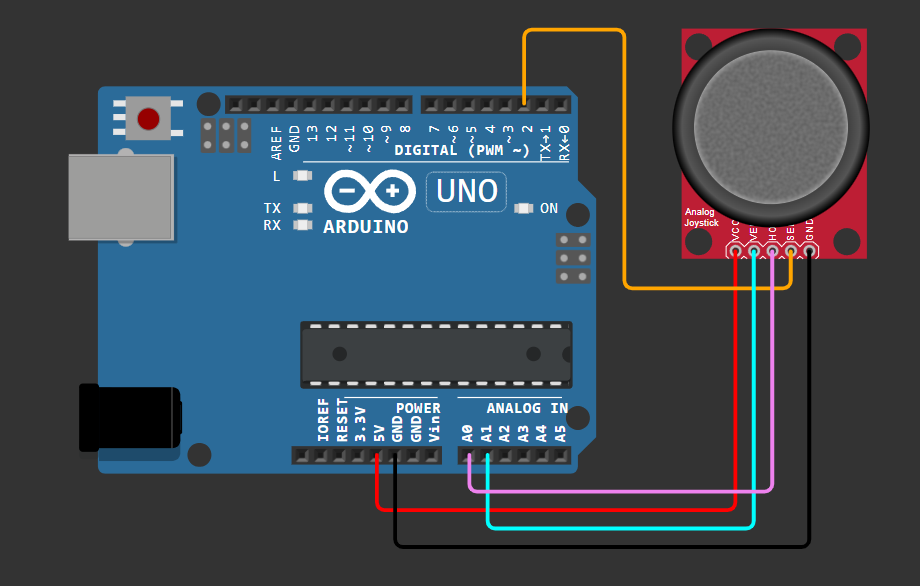
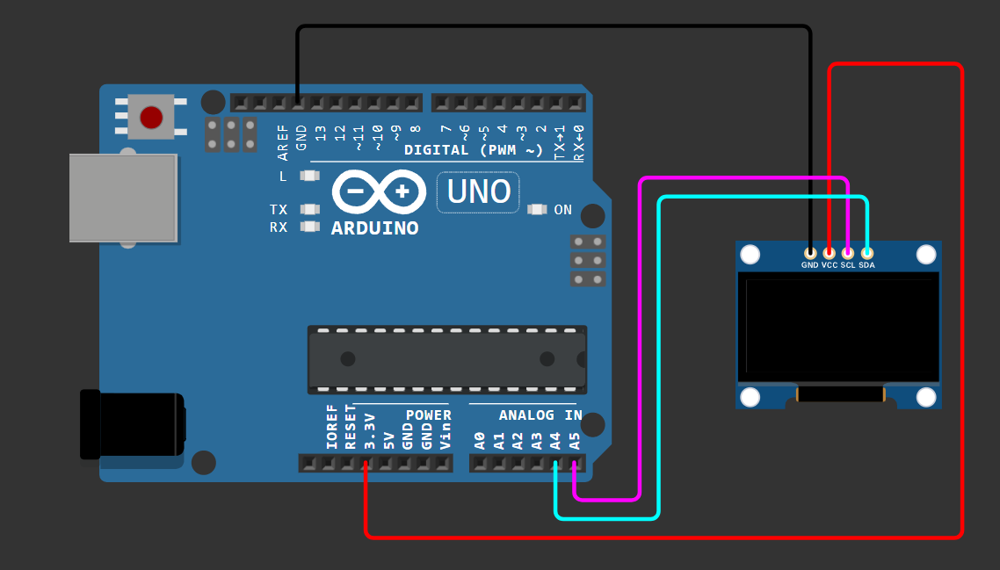

# Instructions
For individual tests of the Joystick and SSD1306 OLED Display (I2C/SPI), go through the following instructions:

## Joystick Module
- Connect the connections as shown in the [**Actual README**](../README.md).
- Upload the [**source code**](Joystick_test.ino) provided.
- Open **Serial Monitor** in **Arduino IDE** for raw analog values for X and Y axes (range is 0-1023, center value is ~512).

## SSD1306 OLED Display (I2C)
- Connect the connections as shown in the [**Actual README**](../README.md).
- Upload the [**source code**](SSD1306_I2C_test.ino) provided.

## SSD1306 OLED Display (SPI)
- Connect the connections as shown in the [**Actual README**](../README.md).
- Upload the [**source code**](SSD1306_SPI_test.ino) provided.
